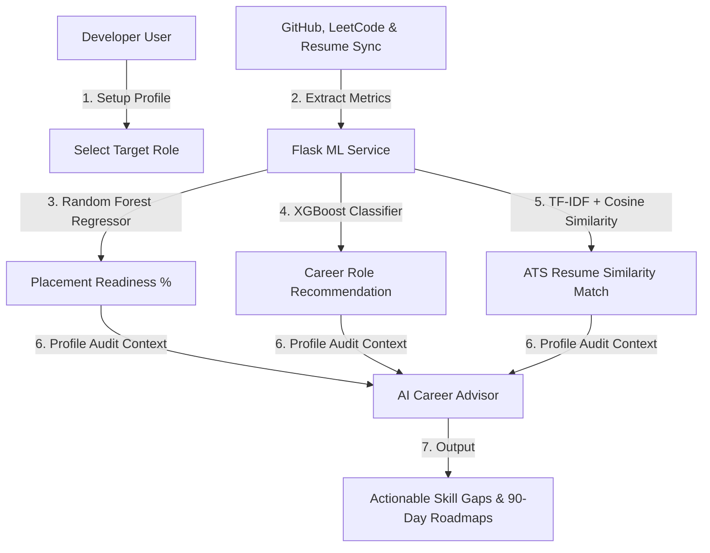

# DevLens: AI & ML Powered Developer Intelligence Platform

DevLens is a premium, pixel-perfect developer analytics and career acceleration dashboard. It audits developer profiles across multiple dimensions—evaluating code repositories, DSA progress, and resume ATS scores—to predict placement readiness and recommend tailored learning pathways.

---

## 🚀 Key Features

*   **GitHub Scraper & Analyzer**: Scrapes repositories to analyze codebase metrics, star/fork counts, commit density, and language composition.
*   **LeetCode Evaluator**: Assesses DSA problem-solving metrics, difficulty distributions (Easy, Medium, Hard), global rank, and active contest ratings.
*   **ATS Resume Optimizer**: Utilizes **TF-IDF Vectorization** and **Cosine Similarity** to match uploaded resumes against target job specifications, highlighting keyword gaps and actionable suggestions.
*   **Placement Readiness Predictor**: Uses a **Random Forest Regressor** model to forecast placement readiness, and an **XGBoost Classifier** to recommend career roles.
*   **AI Career Assistant**: Generates customized 30-60-90 day learning roadmaps, details skill gaps, and answers career queries in real time.
*   **Futuristic UI**: A premium, dark slate developer-centric UI styled with modern glassmorphism, responsive grids, and Recharts radar layouts.

---

## 🛠️ Tech Stack

*   **Frontend**: React.js (Vite), Tailwind CSS (v4), Recharts, Lucide Icons
*   **Backend**: Node.js, Express.js, MongoDB (Mongoose), JSON Web Tokens (JWT), Axios, Multer
*   **ML Microservice**: Python 3.9+, Flask, Scikit-Learn (Random Forest, TF-IDF, Cosine Similarity), XGBoost, Pandas, Joblib

---

## 📂 Project Architecture

```text
devLens/
├── client/          # React Vite Frontend Application
├── server/          # Express API Backend Server
├── ml-service/      # Python Flask Machine Learning Service
└── README.md
```

---

## ⚡ Setup & Installation

Follow these steps to spin up the local development servers:

### 1. Machine Learning Service
Run the training scripts to initialize the ML models and start the Flask API.

```bash
cd ml-service

# Install dependencies
pip install -r requirements.txt

# Generate synthetic dataset and train models
python generate_dataset.py
python train.py

# Start Flask server (Port 5000)
python app.py
```

### 2. Backend API Server
Configure the connection strings and launch the Express router.

```bash
cd server

# Install dependencies
npm install

# Configure environment variables in server/.env:
# PORT=8080
# MONGO_URI=your_mongodb_connection_string
# JWT_SECRET=your_jwt_secret
# ML_SERVICE_URL=http://127.0.0.1:5000

# Start server (Port 8080)
npm start
```

### 3. Frontend Client
Launch the Vite development server.

```bash
cd client

# Install dependencies
npm install

# Start Vite server (Port 5173)
npm run dev
```

Visit the application at: [http://localhost:5173](http://localhost:5173)

---

## 🤖 Machine Learning Decisions Flow


